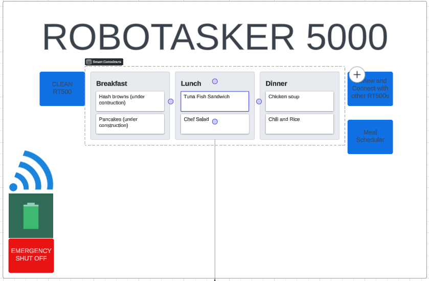
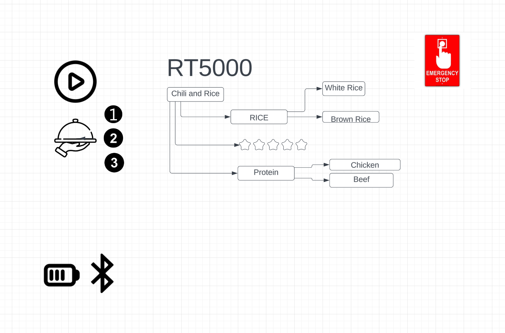

# Group-3-Robot-App-repo

# ROBOTASKER 500
## Interview Questions, User Stories and Requirements
[Trello Board](https://trello.com/w/designingarobotappgroupfinal/home) - individual requirements

[Ramon's interview questions& Github page](https://github.com/RamonGarciiaa/10-interview-questions)

[Aredy's GitHub Page- RT500](https://aquijano10.github.io/RT5000/)

[Arthur's interview questions](https://github.com/muttttt/Group-3-Robot-App-repo/blob/main/ArthurInterviewQuestions)

[Arthur's Github page]( muttttt.github.io/ChickenSoup/ )

[Daniel's Github Page and interview questions](https://github.com/danielgebar/Daniel-s-trello-github-lucid)

## Prioritized Requirements
1. The ability to function
2. The ability to charge
3. The ability to be turned off at any time.
4. The ability to allow users to review meals
5. The ability to schedule meals.
6. The ability to create meals.
7. The ability to connect to other devices
8. The ability to clean
9. The ability to replace parts
10. The ability to display values.

## Landing Page Wireframe

##  Chicken Soup Page Wireframe

## Chili and Rice Wireframe

## Chefs Salad Wireframe Page 

## Tuna fish wireframe Page 
Lucid chart(

